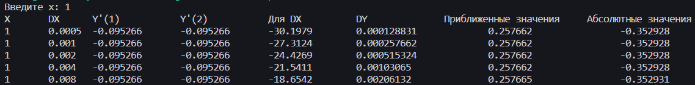

# Лабараторная работа № 11 - 12 "Программы циклической структуры"

# Цель работы
Научиться использьзовать циклические структуры на ЯП C++

# Задание
Для фунции Y = (sin(x)) / ln(2 + sin(x) ^ 2) и вводимого значения X вычислить:
- точное значение производной
    a) упростив за счет дополнительных переменных 
    
    б) не используя дополнительных переменных
- а также вычислить в цикле while для значений DX = (0,0005; 0,001;0,002; 0,004; 0,008; 0,016):
    - приближенные значенњя приращений функции DY = Y(X + DX/2) - Y(X -DX/2)
    - приближенные значения производной по отношению DY/DX
    - абсолютные ошибки приближенных значений производной
    - и вывести полученные значения и соответствующие значени DX в
      виде таблицы с заголовками столбцов.

# Вывод

# Вывод
Я научился использовать циклические структуры на ЯП C++