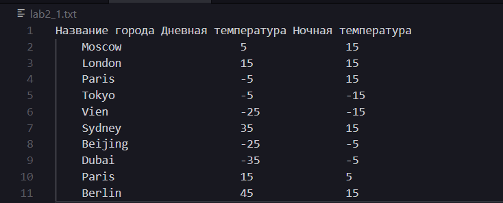
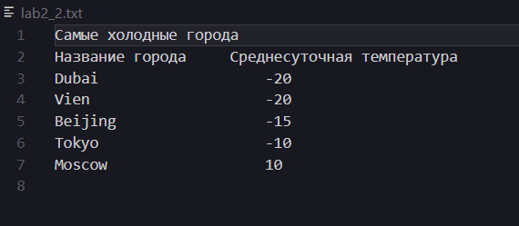
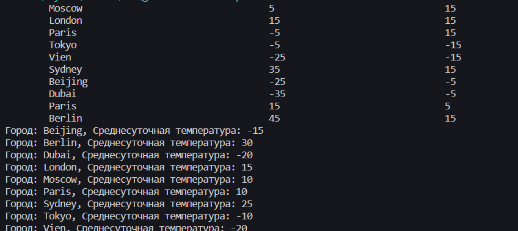

# Лабараторная работа №21 "Обработка текстовых файлов"

## Цель работы:
Научиться пользоваться текстовыми файлами с помощью ЯП C++

## Задание
Сформировать текстовый файл с информацией о названии города, 
средней ночной и средней дневной температурах для опреджеленного месяца. Сформировать второй файл, куда щаписать названия городов и среднесуточнойтемпературой для пяти самых холодных городов.

Первый файл: 

Второй файл:

Вывод данных в консоль для проверки:
